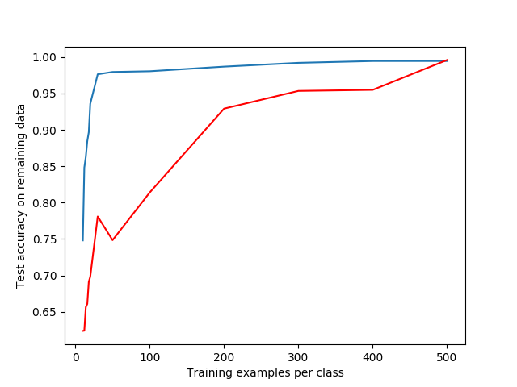
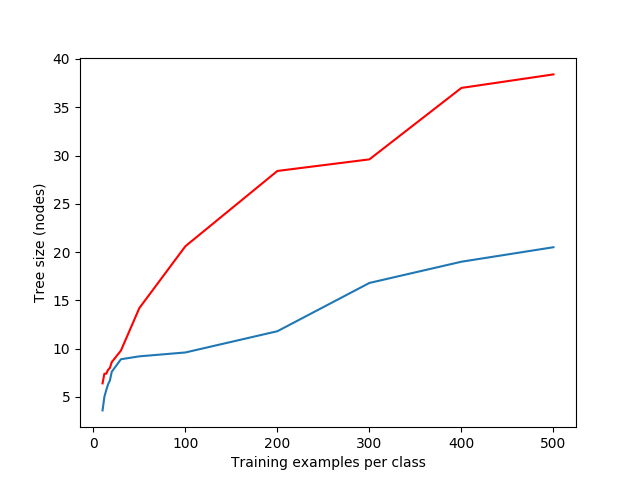

# MDL tree

An implementation of the MDL tree proposed in Quinlan, J. Ross, and Ronald L. Rivest. ”Inferring decision trees using the minimum
description length principle.” Information and computation 80.3 (1989)

My accompanying report can be found in this repo, or by clicking [here](/LARGE_bf_ITS_Project__MDL_for_Decision_Trees.pdf).

The test files can be run using Python 3. I have added a `requirements.txt` containing verified working versions of the dependencies, 
`pip install -r requirements.txt` will install these (I recommend doing this in a venv). 

A description of the contents:
* agaricus\_multi\_test.py creates the average graphs for accuracy and treesize vs N samples
* agaricus\_small\_test.py runs both trees on a small part of the mushroom dataset
* agaricus_test.py runs both trees on the 50/50 split mushroom dataset
* iris_test.py runs both trees on the 50/50 split binary Iris dataset
* small_test.py runs the MDL tree algorithm on the small dataset
* binary\_mdl\_tree\_cont.py contains the BinaryContinuousMDLTreeClassifier which models the MDL tree algorithm from the paper. It can be imported and used in other python scripts.

The iris and agaricus-lepiota dataset are taken from the UCI machine learning repository.
They are only included to ease the use of this project. To acquire these or other datasets I advise you to use their website.

## Results
For a more in-depth explanation, please refer to the [report](/LARGE_bf_ITS_Project__MDL_for_Decision_Trees.pdf).

Below is a comparison between the MDL tree and CART (SciKit Learn implementation without pruning).

_Test set accuracy averaged over 10 different test/train splits with MDL (blue) and CART (red)_

_Number of nodes in the tree for MDL (blue) and CART (red)_
